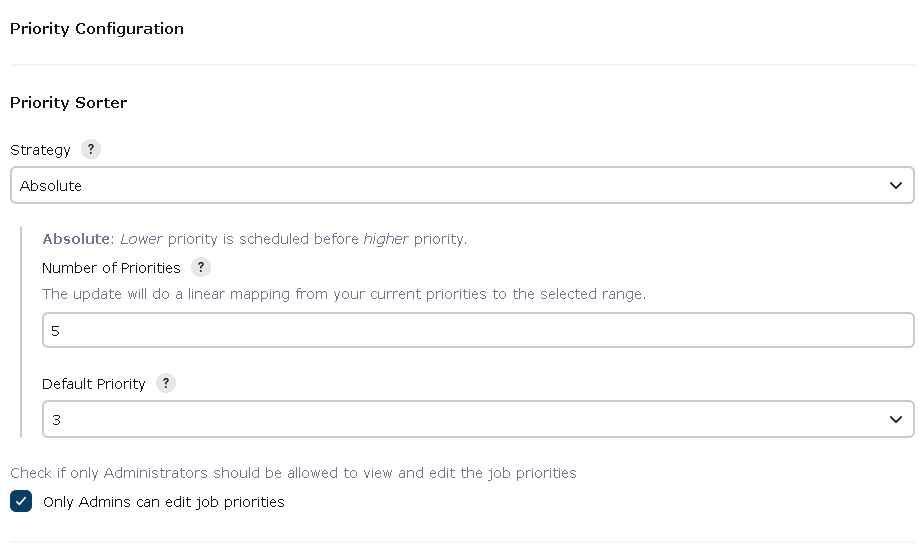
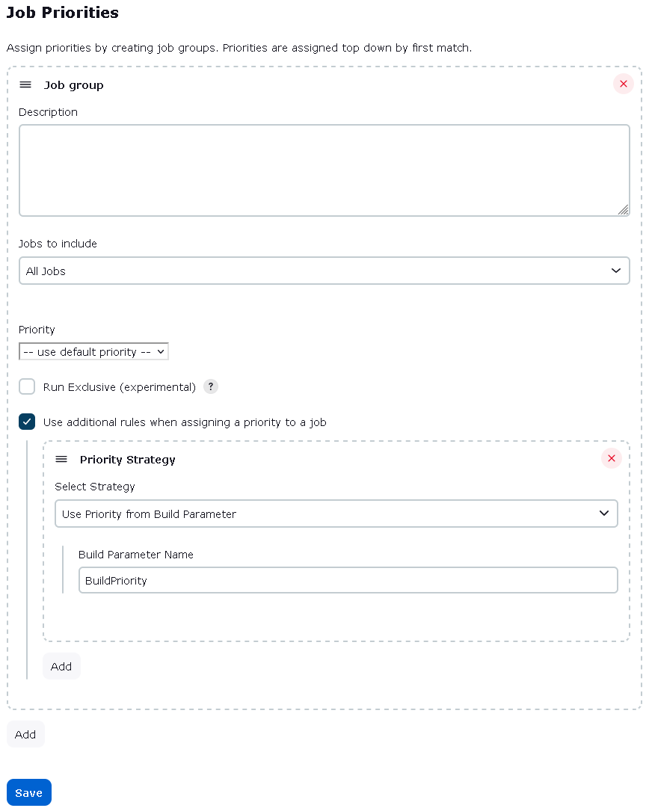

# Jenkins Priority Sorter Plugin

[](https://ci.jenkins.io/job/Plugins/job/priority-sorter-plugin/job/master/)

Adds the ability to assign different priorities to jobs,
the lower the priority a job has, the sooner the job will run.

This can be very helpful, when one wants to add low priority jobs, but
wants to have higher-priority jobs run first. This is especially true
when hardware is limited, or when there are different groups of jobs
that should share resources (equally).

## Fundamentals

The plugin is build around some basic concepts:

-   Queue Strategy
-   Job Group
-   Job Inclusion Strategy, and
-   Priority Strategy.

First, the *Queue Strategy* describes how the priority of a job is
interpreted. It will translate the job's assigned priority to a
corresponding weight in the queue. The queue is, then, sorted based on
the assigned weight.

With the *Priority* Sorter, you will need to group your jobs into *Job
Groups*. A *Job Group*'s *Job Inclusion* Strategy decides whether a
specific job should be included in the group.

The priority of the job is then set by the *Priority Strategy*, and each
*Job Group* can have any number of priority strategies.

When a new job is queued, the following will happen:

-   The *Priority Sorter* will go through the configured *Job Groups*
    from top to bottom.
    -   When it finds a Job Group where the job is to be included, it
        will look through the *Priority Strategies* from top to bottom
        -   When it finds a *Priority Strategy* that matches its
            criteria, it will use this strategy to assign a priority to
            the Job.
-   The *Priority Sorter* will then consult the *Queue Strategy* to
    translate the priority to a weight, i.e. a position in the queue.

## Queue Strategies

There are three included Queue Strategies, each of which will sort the
Queue differently.

### Absolute

Each job will be assigned a priority, and, the lower the priority, the
sooner the job will be run.

### Fair Queuing

Each Job will be assigned a priority, but the queue will try to share
the resources equally over different priorities in a round-robin
fashion.

### Weighted Fair Queuing

The same as *Fair Queuing*, but jobs with a lower priority will be run
more frequently those with higher a priority. Remember, that the lower
the priority assignment, the higher the importance.

## Job Inclusion Strategies

This setting describes which jobs are included in a Job Group, and is
relatively self explanatory. It is worth mentioning the "Jobs Marked for
Inclusion" setting. When this is selected, you are requested to enter a
name of the *Job Group*. This name will then be an available option on
each job, providing an alternative "bottom-up" way to group jobs, rather
than the default "top-down" approach of the other strategies.

## Priority Strategies

It is possible to assign the priority, based on different *Priority
Strategies*.

This setting describes what priority a job should have, and is self
explanatory. It is worth mentioning the "Take the Priority from
Property on the Job" setting. When selected, a drop-down - where you can
select a priority - appears on all projects that would generate jobs to
be included in this group.

## Main Configuration

The main configuration options are available on the Jenkins
configuration page. Configuration options for *Priority Strategy* are
available on its own page, accessible from the root actions menu.

On the main configuration page, you can select the number of priorities
you would like to use, as well as a default priority to use where no
other priority could be assigned.


**Please note that lower number means higher priority! See details on
the screen regarding the specifics on each strategy.**

### Assigning Priorities

On the main menu, you will find the link to a page where you can assign
priorities to each Job


On this page you will be able to assign jobs to groups, and priorities
to jobs.


**Please note that all matching is done top to bottom by first match!**

You can limit access to this functionality to administrators, by
checking the appropriate check-box on the main configuration page.

### Run Exclusive

If a job from a *Run Exclusive* job group gets started, jobs from other
groups will remain blocked, and will not get executed until all jobs
from the *Run Exclusive* job group are complete, regardless of priority.

## Using the View Column

Since a job can get a different priority each time it is started, the
view column cannot show the "correct" priority for the Job.

The column will show the priority used the last time the job was
launched, and, if the job has not been started yet, the column will show
*Pending*.

## Example

Here's one way to use this plugin.  The use-case is we have some
parameterized jobs where we can only execute one run of each job
at a time for business reasons, and each run can take a long time
to execute.  This means there can be a long queue of runs, even
if we have executors available.
Occasionally, there will be "urgent" runs that _must_ execute next,
without having to abort and re-queue existing runs.
With this plugin, we can make it so that such runs will
"jump the queue" and be scheduled ahead of other, lower-priority runs.

### The global configuration

First, we must configure the plugin from the Jenkins configuration page.

Scrolling down to the **Priority Sorter** section,
let's configure the **Absolute** strategy,
with **5** levels of priorities
and a default priority of **3**.
Let's also only let administrators configure job priorities
by checking the **Only Admins can edit job priorities** checkbox:



Let's activate the **Save** button and move to the next part.

### The priority configuration

Next up we will configure the rules to make it possible for some runs to
"skip the line" by letting users enter a priority level as one of
the run's parameters. Runs with a parameter value that doesn't parse as
an integer or without that parameter at all will get the default priority.
Let's go to "Job Priorities" from the root actions menu.

First, we activate the **Add** button.
We can provide a description for this _Job group_,
but ours will be simple enough that it should not need one.

Next, we check the **Use additional rules when assigning a priority to a job**
checkbox and activate its **Add** button.

Let's pick the **Use Priority from Build Parameter** strategy,
and we'll keep the default _Build Parameter Name_ of `BuildPriority`:



We'll keep defaults for everything else and activate that **Save** button.

### The job configuration

First off, the job(s) we will be modifying must already be parameterized
so that there's a difference between successive runs,
otherwise we have no way of distinguishing the runs,
and we therefore have no need for priorities.
For our example, we'll have a Pipeline job called `Sequential`
that users can queue when they have work that needs to be done on
a particular item.
As such, the job already has a `ItemId` parameter.

Let's add a `BuildPriority` parameter and we'll make it easy for our users
by using a "choice" parameter type, defaulting to the lowest priority.

Here's what our _Pipeline script_ might look like:

```groovy
properties([
    disableConcurrentBuilds(), // "Do not allow concurrent builds"
    parameters([  // "This project is parameterized"
        // The job already had this parameter, to distinguish runs.
        string(
            name: 'ItemId',
            trim: true,
            description: 'The ID of the item to be processed.',
        ),
        // We add this parameter to give higher-priority runs the
        // ability to start sooner, ahead of lower-priority runs.
        choice(
            name: 'BuildPriority',
            choices: ['5', '4', '3', '2', '1'],
            description: 'Lower number means higher priority. ' +
                         'Runs with equal priority will execute in the order they were queued.',
        ),
    ]),
])
if (!env["ItemId"]) {
    echo "No value provided for ItemId, nothing to do."
    manager.buildNotBuilt()
    return
}
node() {
    // pretend we're doing work on the item with ID ItemId
    sleep time: 1, unit: 'MINUTES'
}
```

### Testing our job

Let's pretend we have just created a new `Sequential` job with the
_Pipeline script_ as above.  Since it has never run before,
let's queue a run to configure the job for subsequent runs.
This will complete rapidly due to the early return.

Now that the job is aware of its properties (such as the parameters),
we can queue some runs to test out our new priority scheme.
Let's use the following parameter values and queue them quickly,
so that we have queued all of them before run 2 finishes:

| ItemId  | BuildPriority |
|---------|---------------|
| Alpha   | 5             |
| Bravo   | 5             |
| Charlie | 1             |
| Delta   | 5             |
| Echo    | 1             |

After about 5 minutes, we can inspect the runs via their **Parameters** page
to find out in what order they ended up running.
Here's what we observe:

| Run | ItemId  | BuildPriority |
|-----|---------|---------------|
| 2   | Alpha   | 5             |
| 3   | Charlie | 1             |
| 4   | Echo    | 1             |
| 5   | Bravo   | 5             |
| 6   | Delta   | 5             |

Run 2 started right away because there were no other runs
in the queue to compete with.
We then see that both high-priority runs executed in the order they were queued,
followed by the two low-priority runs, also in the order they were queued.

This is exactly what we wanted!

## Declarative Pipeline support

To configure the Job Group for a declarative pipeline job, follow the below example:
```
pipeline {
    options {
        jobGroup jobGroupName: 'MyJobGroup', useJobGroup: true
    }
}
```

## Configuration as Code support

Priority Sorter Plugin has support for use of [Configuration as Code plugin](https://plugins.jenkins.io/configuration-as-code/).

To provide priority configuration follow below example:
```yaml
unclassified:
  priorityConfiguration:
    jobGroups:
      - id: 0
        priority: 1
        description: "Complex"
        runExclusive: true
        usePriorityStrategies: true
        priorityStrategies:
          - priorityStrategy:
              id: 0
              priorityStrategy:
                userIdCauseStrategy:
                  priority: 1
          - priorityStrategy:
              id: 1
              priorityStrategy:
                upstreamCauseStrategy
        jobGroupStrategy:
          folderBased:
            folderName: "Jenkins"
      - id: 1
        priority: 2
        description: "Simple"
        runExclusive: false
        usePriorityStrategies: false
        jobGroupStrategy: allJobs
```

Global settings for priority sorter can be configured like this:
```yaml
unclassified:
  prioritySorterConfiguration:
    onlyAdminsMayEditPriorityConfiguration: true
    strategy:
      absoluteStrategy:
        defaultPriority: 3
        numberOfPriorities: 5
```

For more examples see [tests resources](https://github.com/jenkinsci/priority-sorter-plugin/tree/master/src/test/resources/jenkins/advancedqueue/test/ConfigurationAsCodeTest).


## Notable changes and upgrading

### Upgrading from 2.x

In version **3.x**, the option "Allow priorities directly on Jobs" has
been removed in favor of the Priority Strategy "Take the priority from
Property on the Job" (see above). Legacy Mode is removed (see above
regarding upgrading from version **1.x**).

### Upgrading from 1.x

Version **2.x** is a complete rewrite of the plugin, but still supports
running in version **1.x** compatibility mode. However if you are
satisfied with the functionality of **1.x**, there is little point in
upgrading.  
Upgrading from version **1.x** to version **3.x** will remove all
**1.x** configurations. Therefore, if you need to keep configured
values, upgrade to **2.x**, first, switch to *Advanced Mode*, and then
upgrade from **2.x** to **3.x**.

## Troubleshooting

To get some inside information on how, and why, a certain job gets a
certain priority, you can turn on some extra logging.

-   Logger: ***PrioritySorter.Queue.Items***
    -   To get more info on the assigned priorities, and state
        transition of the items in the queue, set the log level to
        ***FINE***.
    -   To get more info on how the jobs are matched to job groups, and
        rules to get the priority, set the log level to ***FINER***.

To get logging on when the *Queue Sorter* is active, use:

-   Logger: ***PrioritySorter.Queue.Sorter***, with the level set to
    ***FINE***.
    -   To see all items sorted (the queue) by the Queue Sorter, set the
        log level to ***FINER***.

## Release Notes

* For recent versions, see [GitHub Releases](https://github.com/jenkinsci/priority-sorter-plugin/releases)
* For versions 3.6 and older, see the [changelog archive](./docs/CHANGELOG.old.md)

## Report an Issue

Please report issues and enhancements through the [Jenkins issue tracker](https://www.jenkins.io/participate/report-issue/redirect/#15771).
